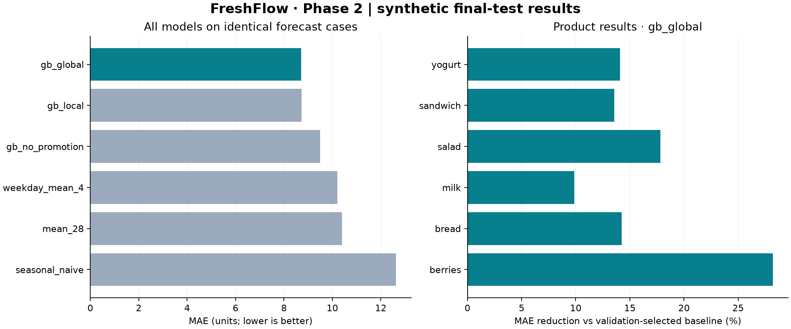

# FreshFlow

### Demand forecasting and inventory optimisation for perishable products

FreshFlow is a Python project exploring how demand forecasts can support better inventory decisions.

The goal is to build a system that forecasts demand, estimates uncertainty and recommends replenishment quantities while considering product expiry, delivery lead times and operational constraints.

> **Project status:** Phases 1 and 2 implemented and locally verified. Baseline forecasts, gradient boosting, leakage checks, promotion/pooling ablations and paired statistical comparisons are available. Forecast uncertainty, inventory simulation and order recommendations remain later phases.

## Run Phase 2

Use **Python 3.12** from the repository root:

```bash
python3 -m venv .venv
source .venv/bin/activate
python -m pip install -r requirements.txt
python -m unittest -v
python phase2.py --smoke
python phase2.py
```

On Windows, activate with `.venv\Scripts\activate` instead of `source`.
The smoke run is a small integration check; the full run evaluates **six models**
across **12 validation and 12 final-test folds**, each forecasting 14 days for all
18 store-product series. The output is saved to `artifacts/phase2/`.

**Updating from the Phase 1 ZIP?** Follow [these terminal-only update and commit instructions](UPDATE_PHASE2.md).
They copy hidden files automatically.

## Phase 2 results

On the declared synthetic benchmark, the validation-selected **global gradient
boosting** model reduces final-test MAE from **10.213 to 8.718 units**, a **14.6%**
improvement over the validation-selected four-week weekday mean baseline.
The test covers 168 days and 3,024 store-product-day forecast cases per model.

| Question | Final-test finding |
|---|---|
| Does boosting beat the selected baseline? | Paired MAE difference −1.494 units; exploratory 95% block-bootstrap interval [−1.803, −1.233] |
| Does explicit promotion information help? | Global model MAE 8.718 vs 9.500 without the promotion flag |
| Is pooling better than separate models? | Global 8.718 vs local 8.721; difference interval [−0.072, 0.064] crosses zero |
| Where does the chosen model help? | Improvements in all six aggregate product segments; berries 28.2%, milk 9.9% |



Read the [full benchmark](reports/phase2/report.md),
[methodology and feature-availability rules](docs/phase2.md), and
[case study with an evidence-backed résumé bullet](docs/phase2-case-study.md).

These are results from one synthetic seed, with promotions assumed known in
advance. They demonstrate a reproducible experiment, not verified retail savings.
The intervals describe average forecast-error differences, not future-demand uncertainty.


## Run Phase 1

Use **Python 3.12**. There are no third-party dependencies or installation steps.
From the repository root:

```bash
python3 -m unittest test_freshflow -v
python3 freshflow.py
```

On Windows, use `py -3.12` instead of `python3` if needed.

The default run generates **13,140 demand rows** across 18 series, evaluates
**12 rolling 14-day validation windows** and a **separate 14-day final test**,
and writes CSV results, a Markdown report and a checksum manifest to `artifacts/`.
The command also prints the report. Re-running replaces files in that directory.

```bash
python3 freshflow.py --seed 43 --output artifacts/seed43
python3 freshflow.py --help
```

Read the [default benchmark](reports/phase1.md), [methodology and data dictionary](docs/phase1.md),
and [project assessment and proposed improvements](docs/project-review.md).

The default validation MAE selects the **28-day mean** (9.984 units); its final-test
MAE is **11.164 units**. The four-week weekday mean has a slightly lower test MAE
(10.986), but the selection remains based on validation. These are single-seed
synthetic benchmark results, not evidence of inventory savings.

## Repository Layout

```text
freshflow.py             # Phase 1 data, validation, baselines and metrics
phase2.py                # Features, boosting, comparisons and report generation
phase2_protocol.json     # Declared experiment settings
requirements.txt         # Tested Phase 2 dependencies
test_freshflow.py         # Phase 1 checks
test_phase2.py            # Temporal isolation and Phase 2 checks
docs/                    # Methodology, case study and project assessment
reports/                 # Small, checked-in benchmark snapshots
UPDATE_PHASE2.md          # Terminal-only update and commit instructions
.github/workflows/ci.yml  # Tests, Phase 1 and Phase 2 smoke check
```

Generated `artifacts/` and Python caches are ignored by Git. The small report
snapshot is committed so readers can inspect results without running the code.
GitHub Actions is configured; its remote run will happen after the files are pushed.

## The Problem

For businesses selling perishable products, inventory decisions involve a difficult trade-off:

- Ordering too little leads to stockouts and lost sales.
- Ordering too much increases holding costs and product waste.
- Products expire, deliveries take time and storage capacity is limited.
- Future demand is uncertain and varies across products, stores and seasons.

A demand forecast alone does not determine the right order quantity. A useful replenishment decision must also account for inventory availability, expiry, incoming deliveries and business costs.

FreshFlow aims to connect these elements in one reproducible workflow.

## The Core Question

**Does a more accurate forecast always lead to a better inventory decision?**

FreshFlow will investigate this by comparing forecasting models and replenishment policies using both prediction metrics and operational outcomes.

The project will examine where improvements come from:

- Better demand predictions.
- Better estimates of uncertainty.
- Better ordering decisions under constraints.

## A Simple Example

Suppose a store forecasts demand for 100 units of milk tomorrow.

The appropriate order quantity also depends on:

- How many usable units are already available.
- Which batches are approaching expiry.
- Whether another delivery is arriving.
- How uncertain tomorrow's demand is.
- The costs of excess stock and unmet demand.

FreshFlow will use this information to evaluate replenishment decisions and their expected consequences.

## Project Roadmap

| Phase | Focus | Key Deliverables |
|---|---|---|
| 1 — implemented | Forecasting foundation | Synthetic data, validation checks, baseline models and rolling backtesting |
| 2 — implemented | Strong forecasting | Global/local gradient boosting, lag/calendar/promotion features, ablations and paired statistical comparisons |
| 3 | Forecast uncertainty | Quantile forecasts, interval calibration and demand scenarios |
| 4 | Inventory simulation | Stock movements, expiry, deliveries, lost sales and cost accounting |
| 5 | Replenishment optimisation | Ordering policies and constrained optimisation under uncertain demand |
| 6 | Experiments and evaluation | Forecast-policy comparisons, stress tests and sensitivity analysis |
| 7 | Interactive application | A planner interface, visual explanations and a reproducible demonstration |

## Initial Scope

The initial forecasting experiment uses:

- Three stores.
- Six perishable products per store.
- Eighteen daily store-product time series.
- A 14-day forecasting horizon.
- Synthetic demand with weekday patterns, seasonality, trend and promotions.

The starting baselines are:

1. **Seasonal naive:** Repeat the most recent observed week.
2. **28-day mean:** Forecast the average demand from the previous 28 days.
3. **Four-week weekday mean:** Average demand from the previous four occurrences of the same weekday.

These establish a benchmark before introducing more complex models.

## Planned Methodology

### Demand Forecasting

Phase 2 compares the three baselines with global and per-series gradient boosting and a promotion-feature ablation. Origin-relative lags, rolling statistics, calendar features and scheduled promotions feed direct multi-horizon forecasts. Statistical comparisons use paired daily errors and a moving-block bootstrap.

### Uncertainty Estimation

Develop probabilistic forecasts to describe a range of possible demand outcomes.

Evaluate whether forecast intervals provide useful coverage and whether demand scenarios improve inventory decisions.

### Inventory Simulation

Build a daily simulator that tracks:

- Inventory by batch and expiry date.
- Outstanding orders and deliveries.
- Fulfilled demand and lost sales.
- Expired stock.
- Procurement, holding, disposal and shortage costs.

### Optimisation

Compare simple ordering rules with constrained optimisation approaches.

Planned constraints include lead times, storage capacity, supplier limits and purchasing budgets.

## Evaluation

FreshFlow will evaluate prediction quality and decision quality separately.

| Area | Planned Metrics |
|---|---|
| Point forecasts | MAE, WAPE, seasonal MASE and forecast bias |
| Probabilistic forecasts | Pinball loss, interval coverage and interval width |
| Inventory outcomes | Total cost, unit fill rate, expired units and waste rate |
| Operational feasibility | Constraint violations and optimisation runtime |

Both phases use chronological rolling backtests and validation MAE for model selection. Phase 2 has a later 168-day rolling test. Future model development needs a new locked holdout because the reported evaluation periods have now been inspected.

## Data and Assumptions

The initial dataset is synthetic and intended for development, learning and controlled experiments.

In the first phase, product availability is unrestricted, so observed sales equal demand. Later phases will address situations where stockouts prevent sales from reflecting true demand.

Public retail data will be introduced for additional forecasting evaluation. Any assumed shelf lives, inventory states or cost parameters will be documented separately.

**Results from synthetic data or inventory simulations will not be presented as verified real-world financial savings.**

## Technology

- **Python:** Core implementation.
- **Python standard library:** Initial forecasting pipeline.
- **Phase 2:** NumPy, scikit-learn and Matplotlib, with pinned dependencies.
- **Planned additions:** Optimisation solvers and Streamlit when their phases begin.

Dependencies will be introduced as the corresponding phases are implemented.

## Intended Outcome

The final system will allow a planner to inspect demand forecasts, understand uncertainty, adjust operational assumptions and compare replenishment decisions.

The project aims to demonstrate an end-to-end workflow covering:

- Time-series forecasting.
- Uncertainty estimation.
- Inventory simulation.
- Mathematical optimisation.
- Business-focused evaluation.
- Reproducible software development.

## Author

**Bodhisattwa Dhara**

Developed as a portfolio and research-oriented project connecting forecasting, optimisation and operational decision-making.

## Update and commit

See [UPDATE_PHASE2.md](UPDATE_PHASE2.md) for extraction, environment setup, testing
and exact Git commands. The pipeline never commits or pushes automatically.
